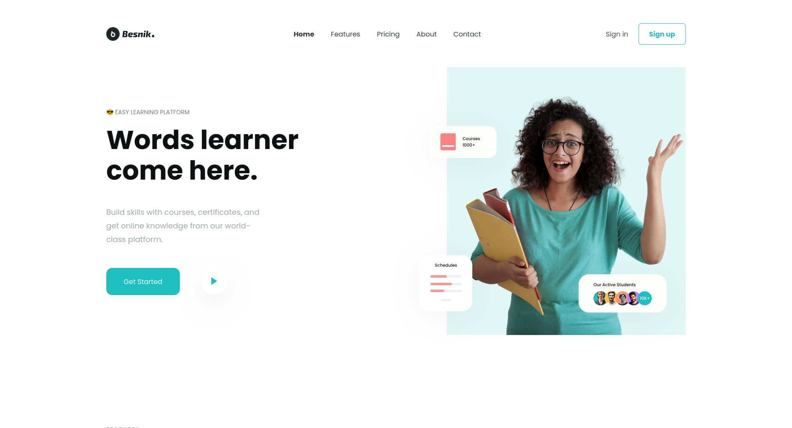

# Learning Platform

## 🚀 Live Demo
👉 [View Demo](https://hieutrinh200.github.io/f8-htmlcss-project-02.1/)

## 📸 Preview

## ✨ Features
- Responsive layout for desktop, tablet, and mobile

## 🛠 Tech Stack
- **HTML5**
- **SCSS (Sass)**

## 📜 Credits
- **Design**: Provided by [F8 Fullstack HTML CSS Pro course](https://fullstack.edu.vn/).
